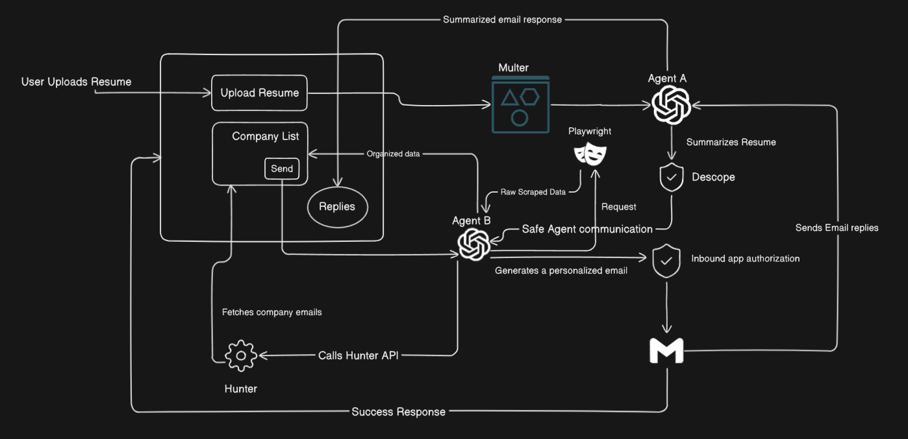

# ResuMate

AI-powered resume-to-outreach assistant. Upload a resume PDF, get a concise summary, discover recently funded startups, fetch key contacts, and send personalized outreach emails via your connected Gmail — all in one flow.

## Team
- Team name: Z-index
- Members: Indroneel Mukherjee

## Hackathon Theme / Challenge
- Theme: 3
- Challenge: Hiring is increasingly broken, with 70% of jobs hidden from public listings and most talent missing the right opportunities. Startups that raise funding typically increase hiring 3 times within 6 months, yet candidates struggle to discover them in time. Traditional job boards are saturated, while cold outreach proves 15% more effective, but remains tedious and insecure. At the same time, autonomous agents are gaining adoption, but lack trusted ways to share user data and call external APIs.


## What I Built
- ResuMate streamlines job outreach:
User uploads resume -> Agent A summarizes resume -> Agent A forwards the summary to Agent B -> Agent B scrapes and fetches recent funded companies and their CEO, CTO, HR emails -> Agent B sends personalized email -> Email responses are fetched from user gmail and then forwarded to Agent A for summarization -> Agent A summarizes the email response to one-liner and categorizes the response between Accepted, Pending and Rejected.




## How to Run Locally

Prerequisites:
- Node.js 18+
- npm or pnpm/yarn
- API keys (Descope, OpenRouter, Hunter, Brevo, Google OAuth)

1) Configure Environment Variables

- Server env at `server/.env.local`:
```
DESCOPE_PROJECT_ID=
OPENROUTER_API_KEY=
BRAVE_API_KEY=
HUNTER_API_KEY=
BREVO_API_KEY=
GOOGLE_CLIENT_ID=
GOOGLE_CLIENT_SECRET=
GOOGLE_REDIRECT_URI="http://localhost:5248/api/auth/callback"
```

- Web app env at `user/.env.local`:
```
DESCOPE_PROJECT_ID=
```

1b) Gmail API Setup (Google Cloud Console)

Follow these steps to allow the app to connect to Gmail and send emails on your behalf.

1. Create or Select a Google Cloud Project
   - Go to https://console.cloud.google.com/
   - Use the project selector (top left) to create a new project or select an existing one.

2. Enable Required APIs
   - In the left sidebar, go to “APIs & Services” → “Library”.
   - Enable the following APIs:
     - Gmail API
     - Google People API (optional, for richer profile data if needed)

3. Configure OAuth Consent Screen
   - Go to “APIs & Services” → “OAuth consent screen”.
   - User Type:
     - “External” is fine for development. Add yourself as a test user.
   - App Information:
     - App name, support email, developer email.
   - Scopes (click “Add or Remove Scopes”): add these scopes used by the backend in `server/agentB.js`:
     - https://www.googleapis.com/auth/gmail.readonly
     - https://www.googleapis.com/auth/gmail.send
     - https://www.googleapis.com/auth/userinfo.email
     - https://www.googleapis.com/auth/userinfo.profile
   - Test users: add the Google accounts you want to log in with during development.
   - Save and continue until finished.

4. Create OAuth Client Credentials
   - Go to “APIs & Services” → “Credentials”.
   - Click “Create credentials” → “OAuth client ID”.
   - Application type: “Web application”.
   - Name: e.g., “ResuMate Local”.
   - Authorized redirect URIs: Add this exact URI used by the backend callback route in `server/agentB.js`:
     - http://localhost:5248/api/auth/callback
   - (Authorized JavaScript origins are not required for this backend flow.)
   - Click “Create”. Copy the generated Client ID and Client Secret.

5. Map Credentials to .env
   - In `server/.env.local`, set:
     - GOOGLE_CLIENT_ID=<your_client_id>
     - GOOGLE_CLIENT_SECRET=<your_client_secret>
     - GOOGLE_REDIRECT_URI="http://localhost:5248/api/auth/callback"
   - Restart the server after updating env vars.

6. Test the Flow
   - Start backend and frontend (see steps below).
   - In the app main page, click “Connect to Gmail”.
   - A new tab opens for Google consent. Approve the requested scopes.
   - After success, the server will store your Gmail tokens in-memory and the UI will reflect “Gmail Connected”.

Troubleshooting:
- If you see “Error 400: redirect_uri_mismatch”, ensure the Authorized redirect URI in GCP exactly matches `http://localhost:5248/api/auth/callback`.
- If consent screen says “This app isn’t verified”, you can proceed for test users in development, or publish/verify later.
- If sending emails fails with token errors, re-run “Connect to Gmail” to refresh tokens.
- Make sure the account you’re using is added as a Test User in the OAuth consent screen when in External/testing mode.

2) Start the Backend (Express)

```
cd server
npm install
node index.js
# Server runs on http://localhost:5248
```

3) Start the Frontend (Next.js)

```
cd user
npm install
npm run dev
# Web runs on http://localhost:3000
```

4) Sign In and Use the App
- Navigate to `http://localhost:3000/sign-in` and complete Descope sign-in.
- You’ll be redirected through `/post-auth` to `/main`.
- Upload a PDF resume, then click “Connect to Gmail” and complete the OAuth.
- Click “Send Emails” to send personalized outreach emails.

Notes:
- The main page is protected by Next.js middleware; a lightweight cookie flag `auth=1` is set after sign-in.
- The frontend attaches `Authorization` and `X-Refresh-Token` headers to protected API calls and auto-updates session via `X-New-Session`.

## Tech Stack
- Frontend: Next.js (App Router), React, TypeScript, `shadcn/ui`, `lucide-react`
- Auth: Descope (Next SDK on frontend, Node SDK on backend)
- Backend: Node.js, Express, Multer (uploads)
- LLM & Tools: LangChain, OpenRouter (LLM), Playwright (light scraping), `pdf-parse`
- Email & Data: Google Gmail API (OAuth2), Hunter.io (contacts), Brevo (transactional emails)

## Demo Video
- Link: <add your demo video link here>

## What I’d Do with More Time
- Add robust error handling, retries, and rate limiting across external APIs.
- Improve email personalization with richer company intelligence and verified contacts.
- Add background jobs/queues for email sending and reply processing.
- More recruiter and company data integration through LinkedIn and AngelList for more personalized email.
- Fine tune the LLM for email classification.
- Email thread Memory based replies to the recruiters.
- Multi agent interview scheduling negotiation.